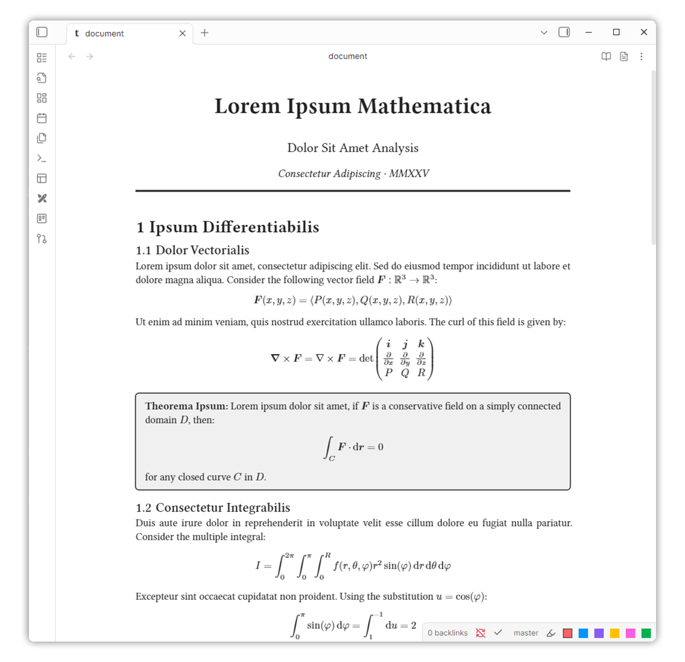
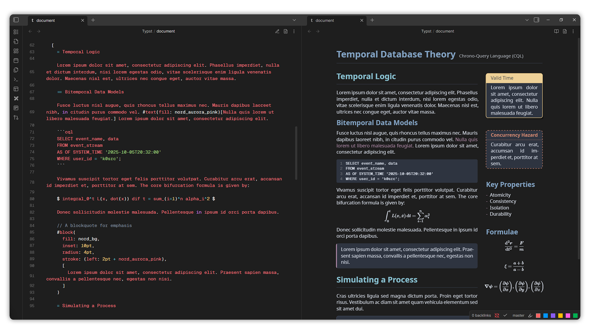
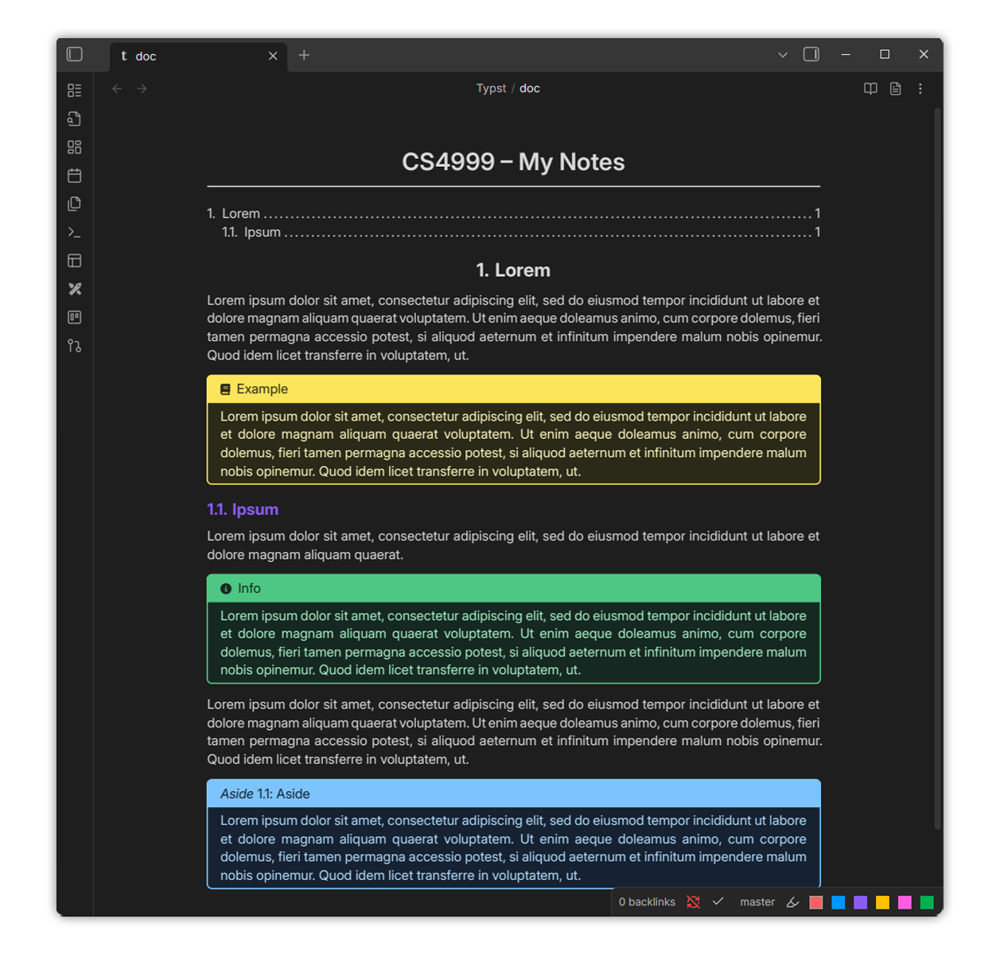

# Typst for Obsidian

Typst for Obsidian is a [Typst](https://typst.app) editor integrated directly into [Obsidian](https://obsidian.md), enabling you to create and preview Typst documents seamlessly within your notes. Create `.typ` files, edit with syntax highlighting, and render PDFs that adapt to your Obsidian theme.

<p align="center">
  
</p>

## Features

- Open `.typ` files in Obsidian
- Typst editor with syntax highlighting
- Toggle between source and PDF preview modes
- PDF export to vault
- Theme integration - rendered PDFs adapt to Obsidian themes
- Template variables for dynamic theming (`%THEMECOLOR%`, `%FONTSIZE%`, etc.)
- Package support - use local packages from data directory or auto-download from preview namespace
- System font support (desktop only)



## Usage

1. Create a new `.typ` file or open an existing one
2. Edit in source mode with syntax highlighting
3. Click the preview icon to render PDF
4. Click the export icon to save PDF to vault

### Template Variables

Use these variables in your Typst documents to match Obsidian themes:

```typst
#set text(fill: rgb("#%THEMECOLOR%"), size: %FONTSIZE%)
#set page(fill: rgb("#%BGCOLOR%"), width: %LINEWIDTH%)
```

Available variables:

- `%THEMECOLOR%` - Primary text color
- `%FONTSIZE%` - Text size in pt
- `%BGCOLOR%` - Background color
- `%LINEWIDTH%` - Page width
- `%ACCENTCOLOR%`, `%FAINTCOLOR%`, `%MUTEDCOLOR%`
- `%BGPRIMARY%`, `%BGPRIMARYALT%`, `%BGSECONDARY%`, `%BGSECONDARYALT%`
- `%SUCCESSCOLOR%`, `%WARNINGCOLOR%`, `%ERRORCOLOR%`
- `%FONTTEXT%`, `%FONTMONO%`, `%HEADINGCOLOR%`

### Custom Layout Functions

Configure default page layouts in settings:

- **Default Layout Functions** - Applied to all internal previews
- **PDF Export Layout Functions** - Applied only when exporting PDFs

### Custom Snippets

You can add custom Typst snippets as JSON for autocomplete in settings. Each snippet has a prefix (trigger) and body (lines to insert). Use `${}` for tab stops, and press `Tab` to jump between them.

Example (inserting a table aligned to the center):

```json
{
  "table": {
    "prefix": "tbl",
    "body": [
      "#align(center,",
      "\ttable(",
      "\t\tcolumns: ${},",
      "\t\t[${}],",
      "\t)",
      ")"
    ]
  }
}
```

## Official Template

You can use the [official template](https://github.com/k0src/Typsidian) designed for Typst in Obsidian. It includes support for light/dark modes, titles, headers, and useful functions for displaying notes.

<p align="center">
  
</p>

To get started, import the template at the top of your Typst file:

```typst
#import "@preview/typsidian:0.0.1": *;

#show: typsidian.with(
  theme: "dark",
  title: "My Document",
  course: "CS4999",
  standalone: false // Removes template page functions
)
```

This template is an Obsidian-like theme for Typst, with support for light/dark modes, titles, headers, and some useful functions for displaying notes.

> [!NOTE]
> When using this template, I recommend setting the custom layout function in the settings to:

```typst
#set page(
  width: %LINEWIDTH%,
  height: auto,
  margin: (x: 0.25em, y: 0.25em),
  fill: rgb("%BGCOLOR%")
)
```

Make sure to set `standalone: false`. This will prevent the template from adding its own page layout. Additionally, make sure you have the required fonts installed and added to the font families in settings:

- [Inter 24pt](https://fonts.google.com/specimen/Inter)
- [GeistMono NFP](https://github.com/ryanoasis/nerd-fonts/releases/)
- [Fira Math](https://github.com/firamath/firamath/releases/)

## Settings

- **Default Mode** - Open files in source or reading mode
- **Auto-download Packages** - Automatically fetch packages from Typst registry
- **Font Families** - System fonts to load (desktop only)
- **Layout Functions** - Custom Typst preambles for formatting
- **Enable Text Layer** - Enable text selection in PDF preview. Disabling this setting may improve performance
- **Custom Snippets** - Add custom Typst snippets for autocomplete

## Commands

- **Create new Typst file** - Create `.typ` file at specified path
- **Toggle source/reading mode** - Switch between editing and preview

## Keyboard Shortcuts

- `Ctrl+B` - Bold (`*text*`)
- `Ctrl+I` - Italic (`_text_`)
- `Tab` - Accept autocomplete suggestion

_Currently, keyboard shortcuts only work when Obsidian hotkeys for the same hotkey are disabled._

## Installation

1. Download the latest release from the [Releases](https://github.com/k0src/Typst-for-Obsidian/releases) page
2. Extract `main.js`, `manifest.json`, `styles.css`, and `obsidian_typst_bg.wasm` to your Obsidian plugins folder (`.obsidian/plugins/typst-for-obsidian`)
3. Enable the plugin in Obsidian settings

## How it Works

- The plugin integrates the Typst compiler directly into Obsidian using WebAssembly, allowing it to run in the browser.
- It manages two modes: source mode (for editing) and reading mode (for PDF preview).
- The editor view uses CodeMirror 6 Typst editor with syntax highlighting, autocomplete, and keybindings.
- The viewer renders PDFs using PDFium, with support for text selection and links.

### Compilation Process

When compiling a document, the plugin first processes the source code through several stages:

1. If enabled, custom layout functions are prepended to the source. These can be different for internal previews vs PDF exports, allowing different formatting for each use case.
2. Before compilation, all template variables (like `%THEMECOLOR%`, `%FONTSIZE%`) are replaced with values extracted from the current Obsidian theme.
3. The processed source is then sent to a Web Worker running the Typst compiler.

### WebAssembly Compiler

- The core compiler is written in Rust and compiled to WebAssembly.
- The compiler uses the official Typst library to parse and compile documents to a PDF.
- On desktop, system fonts are loaded into the WASM module via the Local Font Access API and are registered with Typst's font system.
- The plugin fetches Typst packages from the official repository and caches them locally, and gets packages from the Typst data directory on desktop.

### PDF Rendering

- Each page is rendered to a canvas with scaling for high-DPI displays, using PDFium.
- Text layers are overlaid for selection and annotation layers are rendered for interactive elements like links.

## Development

### Build

```bash
npm install
cd compiler
cargo build --release
wasm-pack build --target web --out-dir ../pkg
cd ..
npm run build
```

## Future Plans

Due to grammar limitations and other reasons, the next step is replacing the CodeMirror6 editor view with [Monaco Editor](https://microsoft.github.io/monaco-editor/) (the editor used by VSCode). In short, CodeMirror6 uses a parser grammar system called [Lezer](https://lezer.codemirror.net/), which is what the first version of the [Typst grammar](src/grammar/typst.grammar) was implemented with. The problem is, Typst is a pretty tricky language to parse. It has a 3 modes (code, plain text, and math), and sometimes, keywords or variables can mean different things in different contexts. Due to this, it's very hard to write a [declarative grammar](https://lezer.codemirror.net/docs/guide/#writing-a-grammar) that can be used to parse Typst markup. Instead, the [Monarch](https://microsoft.github.io/monaco-editor/monarch.html) tokenizer can be used to parse Typst (the [Tinymist LSP](https://myriad-dreamin.github.io/tinymist/) can possibly be used too).

Getting syntax highligting working properly is the first step. Next is implementing incremental PDF rendering, and a proper editor-preview split view. This basically requires a whole rewrite of the compiler, making it stateful and memoizing the PDF.

### Other Goals

- [ ] **Improve performance of PDF rendering**
- [ ] **Polish PDF viewer, fix text layers, add annotation layers**
- [ ] **Polish editor UI**
- [ ] Add more keyboard shortcuts, more robust editor features
- [ ] Formatter for Typst code
- [ ] Add support for jumping from PDF to source by clicking on text
- [ ] Add backlink support in PDF preview
- [ ] Support for more template variables
- [ ] Improve error handling and reporting
- [ ] Support Typst packages that use WebAssembly modules
- [ ] Add more settings for customization

## Known Issues

- Packages that import WebAssembly modules (like CeTZ) do not work, because WASM modules cannot be imported into other WASM modules in the browser
- Returning to scroll position when switching between source and preview modes is jittery

## Credits

Compiler implementation inspired by [fenjalien/obsidian-typst](https://github.com/fenjalien/obsidian-typst).

## License

MIT
